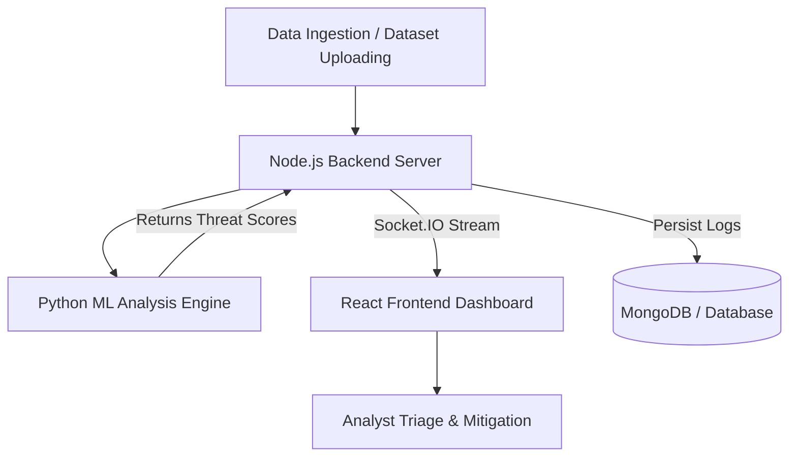
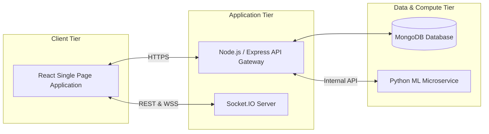

# Regiment: Defence-Grade Communication Anomaly Detection System

## 1. Problem Context

**Real-world context (where this problem exists)**
In highly secure environments—such as defense sectors, critical infrastructure, and enterprise data centers—communication networks face sophisticated zero-day threats, lateral movement attacks, and stealthy insider data exfiltration that evade traditional security tripwires.

**Who faces this problem (target users)**
Security Operations Center (SOC) analysts, network administrators, threat hunters, and defense cybersecurity personnel.

**Current limitations or pain points**
- **Alert Fatigue:** High false-positive rates from rigid, signature-based systems cause analysts to ignore critical alerts.
- **Outdated Detection:** Relying on static rules fails against novel and adaptive threats.
- **Fragmented Visibility:** Sluggish tooling lacking a single-pane-of-glass, real-time visualization makes rapid triage difficult.
- **Cognitive Overload:** Complex, cluttered interfaces slow down response times in high-stress scenarios.

**Any supporting data or statistics**
According to recent industry reports (such as IBM's Cost of a Data Breach), the average time to identify and contain a breach often exceeds 250 days. Furthermore, alert fatigue causes up to 40% of critical security alerts to go uninvestigated daily.

**Exact one-line problem definition**
Critical communication networks lack an intuitive, real-time ML-powered monitoring system to instantly detect, visualize, and triage elusive anomalous threats before data exfiltration occurs.

---

## 2. Solution Definition

**Core idea (simple and straightforward)**
Regiment is a defense-grade anomaly detection dashboard that leverages machine learning to proactively monitor and visualize suspicious network communications in real-time within a clean, low-cognitive-load interface.

**Key features (3–5 main functions)**
1. **Real-Time Threat Monitoring:** Live data stream visualization using WebSockets (Socket.IO).
2. **Machine Learning Anomaly Engine:** A dedicated Python microservice that analyzes datasets for probabilistic deviations rather than relying on static rules.
3. **Interactive Visual Dashboard:** A deeply integrated React-based interface offering data breakdowns and status tracking.
4. **Dataset Management & Ad-hoc Scanning:** Ability for analysts to upload historic network datasets and trigger manual ML analysis jobs.
5. **Immutable Audit Logging & RBAC:** Secure tracking of system events and tiered user access (Admin vs. Analyst roles).

**Why is this solution better than current methods**
It replaces easily bypassed static signature rules with a dynamic, adaptable ML engine. Furthermore, it wraps this power in a highly specialized, military-inspired UX—purposely designed using clean typography like Montserrat and strict UI spacing to lower cognitive load during high-stress incident response.

**Approach or workflow summary**
1. Network data logs or manual datasets are ingested into the Node.js backend.
2. The data is handed off to the Python ML microservice for anomaly scoring.
3. Once scored, results are returned to the database.
4. The Node.js server broadcasts real-time Socket.IO events to the frontend.
5. The React dashboard instantly updates visual metrics, alerting the analyst to take action.

**Small flowchart/block diagram**

---

## 3. Technical Architecture

**Frontend, Backend technologies**
- **Frontend:** React (Vite), Tailwind CSS (for defense-grade styling), Zustand (State Management), React Router, Recharts.
- **Backend:** Node.js, Express.js.
- **ML Services:** Python, Scikit-learn/TensorFlow.

**Database / Storage**
- **Primary Database:** MongoDB (Mongoose) for storing AnomalyResults, Audit Logs, and User Profiles.

**APIs or cloud services**
- REST APIs for standard CRUD operations and dataset uploads.
- WebSockets (Socket.IO) for bi-directional live streaming of alerts to the client.

**Any hardware (if applicable)**
- Hardware-agnostic. Can be deployed on air-gapped on-premise defense servers or standard scalable cloud infrastructure (AWS/Azure).

**System architecture diagram**

**Development tools**
- IDE: Visual Studio Code
- Version Control: Git / GitHub
- Design: Figma (for UI mockups)
- Bundling/Tooling: Vite, npm

---

## 4. Impact & Scalability

**Direct benefits to users or community**
Provides SOC teams with a razor-sharp, distraction-free environment that empowers them to catch threats rapidly without succumbing to alert fatigue, ultimately securing sensitive user data and proprietary defense information.

**Quantifiable improvements**
- **Time Saved:** Reduces Mean Time to Detect (MTTD) from weeks/days down to seconds via live WebSocket streams.
- **Accuracy Gained:** Leverages ML to significantly reduce false positive rates compared to legacy rule-based systems.

**Environmental or social impact**
By preventing breaches on critical infrastructure (like power grids, telecom, or healthcare), the system protects society from the compounding fallout of major service disruptions and data theft.

**Scalability — how it can be expanded**
The microservice architecture natively supports horizontal scaling. The Python ML nodes can be spun up across Kubernetes clusters to handle massive influxes of network traffic, while the Node backend scales to maintain thousands of concurrent WebSocket connections.

**Future enhancements or features**
- **Automated Mitigation (IPS):** Integrating scripts to automatically sever compromised connections.
- **GenAI Explanations:** Using LLMs to provide plain-english summaries of *why* the ML model flagged a specific packet.
- **Graph-based Threat Mapping:** Visualizing IP lateral movement as 3D node meshes.

**Potential industry applicability**
- Defense and Intelligence operations
- Financial Institutions (Fraud anomalies)
- Healthcare Data Integrity
- Telecom Infrastructure Providers
